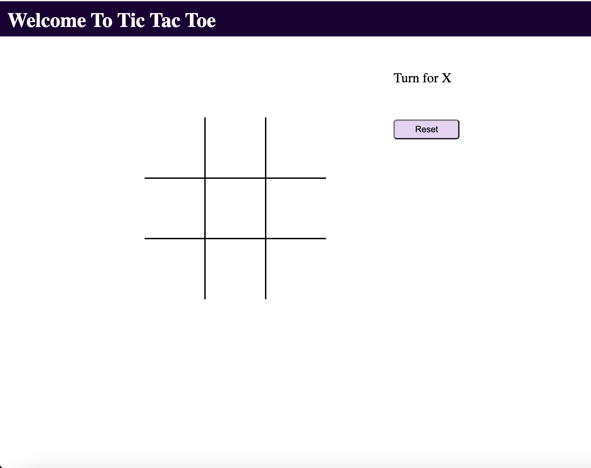

# TIC TAC TOE GAME

###### DEPLOYED LINK
https://ritahc.github.io/Tic-Tac-Toe-Project/

# User Story

-Two people can play this game together by clicking on the board alternatively.

-Whenever a player is able to mark 'X' or 'O' three-times in a row, they win.

-If none of the player wins, it's a draw.

# Technologies Used
1. HTML5
2. CSS
3. Java Script

# Image of the game

# Link to the game
https://ritahc.github.io/Tic-Tac-Toe-Project/
